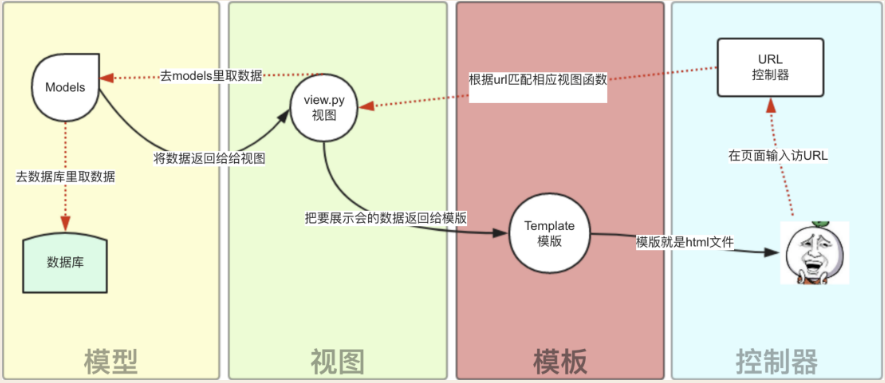

# 旅行社机票预订系统

2022.12.4

## 开发框架

编辑器 pycharm专业版

后端 Django 4.1.3

数据库 mysql

前端框架 Bootstrap5

## 搭建python环境

[使用 Pycharm 创建一个 Django项目](https://blog.csdn.net/m0_62617719/article/details/125053470)

anaconda创建虚拟环境flight

python版本3.10

pip install django

pip install django_simpleui

## Django教程

[Django 4.1 官方文档](https://docs.djangoproject.com/zh-hans/4.1/)

[Django教程 RUNOOB](https://www.runoob.com/django/django-tutorial.html)

[Django连接MySQL数据库的两种方法（pymysql与mysqlclient）](https://blog.csdn.net/q1694222672/article/details/82352076)

## Django框架



- [x] URL控制器
- [x] Template
- [ ] View （我根据前端需要的情况写了一些View，需要与数据库交互的部分注释了TODO）
- [ ] Models（未完成）

## 文件框架介绍

- **manage.py** 封装了一系列可以通过cmd实现的功能，如 ```python manage.py startapp myapp```创建了一个应用
- **static** 存储静态数据，包括外部包，图片，js，css等（后因static文件的缓存太严重，把js文件挪到了html里面）
- **templates** 模板模块，存储静态网页

- **db.sqlite3** 根据默认数据库配置生成的数据库，可删除，替换为mysql

- **flight** 项目初始文件夹，与项目同名，一般在多应用架构中负责应用间的协调与调度
  - **urls.py** 控制器模块，浏览器发到服务器后首先访问的文件，一般应根据URL转到对应应用的urls.py文件，再匹配对应views.py文件中的视图，本项目只创建了一个应用，偷懒直接将所有URL写在本文件中，本文件直接根据路径跳转到myapp的views.py中
  - **settings.py** 项目配置文件，django大部分关于项目架构的改动都需要通过setting更新

- **myapp** myapp应用所在的文件夹，也是本项目唯一的应用，django通过创建若干个应用实现模块化，如果要使用model必须建立一个应用
  - **views.py** 和myapp相关的视图处理函数，在本项目中就是视图模块
  - **model.py** 模型模块，对数据库实现增删改查，在model中一个类就是一张数据表，一个对象就是一个数据行，一个类属性就是一个字段

## 网页结构

- 登录界面
  - 身份分为管理员与旅行社
  - 登录成功跳转至管理员主界面或旅行社主界面
  - 登录失败回到本界面并显示相关报错信息
  - 前端检查账号和密码不为空，长度不超过40
- 旅行社注册界面
  - 只能注册旅行社，在学长的文档中，管理员也可以注册，我把这个功能挪到了管理员主界面里面
  - 注册成功跳转至注册成功界面，若干秒后跳回登录界面
  - 注册失败则回到本界面并显示相关报错信息
  - 前端检查账号和密码，要求用户名长度2-40位，密码8-40位，密码至少包含数字和字母
- 取票界面和机票展示界面
  - 取票界面输入身份证，无论身份证对应的旅客是否存在都将跳转到机票展示界面
  - 前端检查身份证18位，最后一位允许为X，不对身份证内容检查
  - 具体内容在机票展示界面显示显示对应旅客的订单信息，如果未支付将显示支付按钮，否则显示取票按钮
  - 支付和取票都是假按钮，无反馈，就当成功了吧
- 旅行社主界面
  - 航班模块
    - 航班查询
      - 可购票，购票需先后点击对应航班号、舱位类型、旅客（不应显示已经订过该航班号的旅客），旅客提供批量选中
  - 旅客模块
    - 查看旅客
      - 可删除旅客
    - 添加旅客
      - 输入姓名、身份证、性别、联系方式，前端检查身份证的格式，联系方式至多11位
  - 订单模块
    - 查看订单
      - 可支付或取消订单
  - 修改账号密码
    - 要求密码8-40位，密码至少包含数字和字母
  - 账号退出功能
- 管理员主界面
  - 航班管理模块
    - 查看航班，删除航班，修改航班
    - 新增航班
  - 订单管理模块
    - 查看订单，删除订单，修改订单
    - 新增订单
  - 管理员注册模块
    - 要求密码8-40位，密码至少包含数字和字母
  - 账号退出功能


## 其他

本地端口 127.0.0.1:8000

学长的报告中，航班的出发时间和到达时间等没有日期信息，我把航班的起始时间的格式规定为 yyyy-mm-dd hh:mm ，方便我前端做一些处理

座位类型我写死了只有三种：经济舱、商务舱、头等舱

前端在输入票价时，我偷懒限制为了整数

旅客的联系方式我限制在了15位

Django在使用chrome打开前端时，好像有很多缓存，我修改html之外的文件会有延时，甚至关了重开也没用，如果改了发现没反应可以换个浏览器试试

